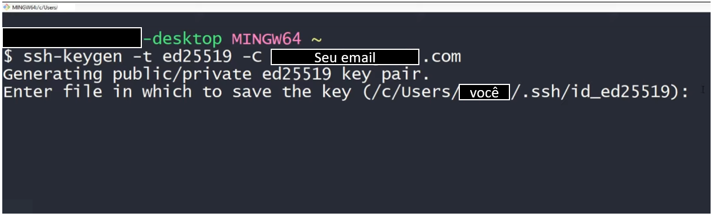
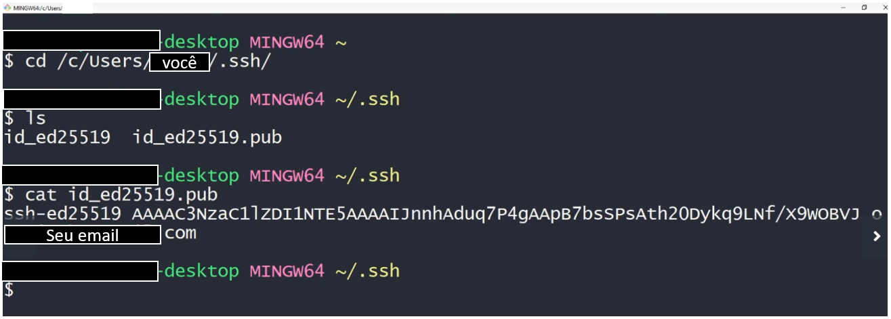
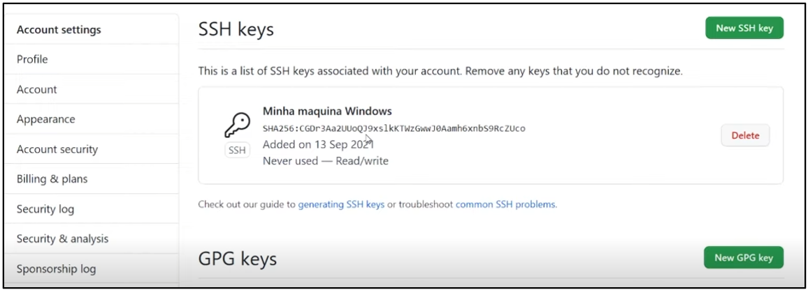
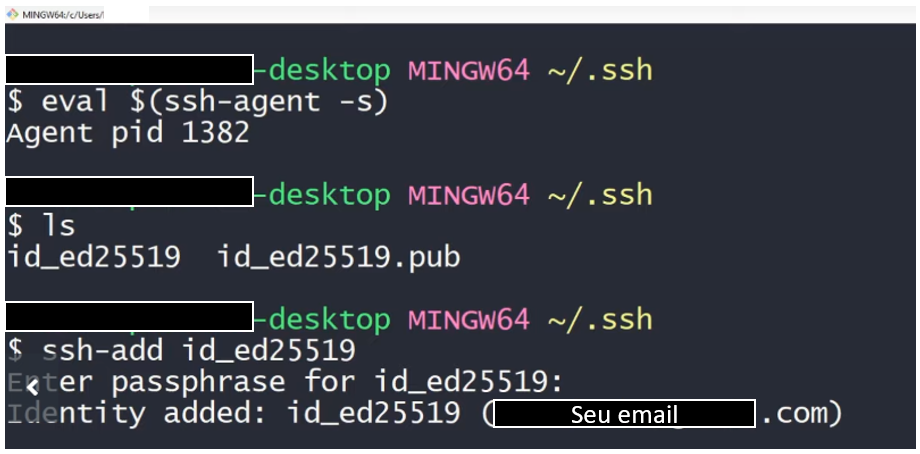

# Criando chave SSH para acesso ao GitHub (Windows) :key:

Artigo baseado na Aula "Chave SSH e Token" do curso "Introdução ao Git e ao GitHub" do Professor Otávio Reis (Perkles._)

**Requerimentos:**  Conhecimento dos comandos básico de navegação no terminal Git Bash

## Por que criar chaves SSH de acesso?

O GitHub, como forma de segurança, sempre solicita autenticação antes de permitir que o conteúdo dos repositórios da plataforma sejam manipulados/empurrados via (git push) para a plataforma.

Chave SSH, resumidamente, é uma forma de autenticação que estabelece um caminho seguro entre 2 máquinas. Dessa forma é possível acessar recorrentemente ao GitHub para realizar ações sem a necessidade de sempre estar digitando senha e usuário, e mesmo assim ainda preservando a segurança da conta e da plataforma.

### Primeira Etapa: Criando chave SSH para GitHub

Para cria um par de  chaves SSH e sincronizá-las em sua máquina, primeiro você precisa ter uma conta no [GitHub](https://github.com/) e ter instalado o terminal [Git](https://git-scm.com/downloads) e assim utilizar o terminal "Git Bash". Faremos todo o procedimento via terminal de comando. Vamos gerar nossas chaves.

* Passo 1 - Primeiro abra o terminal do Git Bash e digite exatamente (incluindo as aspas) na seguinte linha de comando:

  

  <code>ssh-keygen -t ed25519 -C "seuemail.@provedordoemail.com"</code>

  

  Se o comando estiver correto, deverá aparecer a seguinte mensagem no terminal:

  *"Generating public/private ed25519 key par. Enter file in wich to save the key (/c/users/você/ .ssh/id_ed25519):"* 

  

  Neste momento o terminal está solicitando o local onde seu par de chaves SSH serão criados. Recomendamos deixar o local indicado e apenas clicar em Enter. **Digite uma senha para sua chave** e novamente pressione enter.

  

* Passo 2 - Após a mensagem informando que suas chaves foram salvas com sucesso no diretório ".ssh",  navegue até o local utilizando os comandos "cd .." (para voltar um nível no diretório de cada vez) e "cd /diretório" para entrar no diretório escolhido, no terminal do Git Bash.

  

* Passo 3 - Utilize o comando "ls" ou "dir" para listar os arquivos salvos dentro da pasta. Deverá aparecer 2 arquivos: id_ed25519 (sua chave privada) e id_ed25519.pub (sua chave pública que será utilizada no GitHub) . Agora utilizaremos o comando "cat" para visualizar o conteúdo do arquivo id_e25519.pub, então copiaremos o resultado da visualização e colocaremos no GitHub.

  

  

* Passo 4 - Abra sua página do GitHub, clique em "Settings" depois procure pelo item "SSH and GPG keys" e abra o link. Uma vez na página, clique em "New SSH key", digite um título de identificação para sua chave e no campo "key", cole o resultado da visualização do arquivo id_25519.pub obtida com o comando "cat" do passo 3.

  

* Passo 5 - Clique em "Add SSH key", o GitHub solicitará uma confirmação via usuário e senha, entre com seus dados e vua-lá! Chave SSH criada e incluída no GitHub. Mas calma que ainda é necessário realizar mais uma etapa antes de começar a usar sua chave.

  

  

  

## Segunda Etapa: Ligando o SSH agent

Após criar e incluir sua chave pública no GitHub, precisamos iniciar um "agente SSH" que ficará "encarregado" de utilizar as chaves e "liberar nosso acesso" a cada vez que utilizarmos o Git Bash para versionar nossos códigos e projetos na plataforma.

* Passo 1 - No terminal de comando e dentro da pasta "/.ssh" digite a seguinte linha de comando para "startar" o ssh agent que rodará no plano de fundo.

  <code>eval $(ssh-agent -S)</code>

  

* Passo 2 - Após startar nosso agente, ainda dentro da pasta  "/.ssh", precisamos passar o caminho da nossa **chave privada** que será utilizada pelo agente para autenticar nosso acesso via terminal Git. Digite no terminal:

  <code>ssh-add id_25519</code>

  O terminal solicitará a senha da chave (criada no passo 1 da primeira etapa) e pronto. Nosso agente já tem as informações para liberar o acesso via SSH e sincronizar as ações com o GitHub.

  

  

## Terceira Etapa: Validando todo o trabalho

Agora que já criamos nossas chaves SSH, adicionamos nossa chave pública no GitHub e configuramos nosso agente SSH, vamos realizar nosso primeiro acesso e autenticar nossa chave SSH pela primeira vez.

* Passo 1 - Em uma pasta reservada para o nosso teste, nós vamos utilizar pela primeira vez o comando "clone" no Git Bash. Abra o GitHub e navegue até o repositório que você deseja utilizar no nosso teste. Na página do repositório, clique no botão "code" e selecione o link SSH fornecido (não confundir com link HTTPS).

  

* Passo 2 - Com o link SSH copiado, volte até o Git Bash e, em um diretório criado separadamente para o nosso teste, digite:

  <code>git clone "cole o link sem aspas"</code>

  Caso seja sua primeira conexão, o terminal exibirá uma mensagem sobre o fingerprint com o número mostrado no terminal. Digite "yes" e pressione enter novamente. Pronto, o repositório já está sendo clonado e será finalizado o download.

  **Parabéns!** Você concluiu a criação de chaves SSH e sincronizou com o seu repositório do GitHub! :call_me_hand:

  

## Considerações

Neste artigo foi apresentado um passo a passo resumido de como criar uma chave SSH local para conexão com GitHub via Git para a plataforma Windows. Nos próximos artigos traremos também tutoriais para as plataformas Linux e Mac. Falaremos também sobre Tokens.

## Agradecimentos

Ao professor Otávio Reis pelas excelentes lições que contribuíram para a minha formação e para a confecção deste artigo
